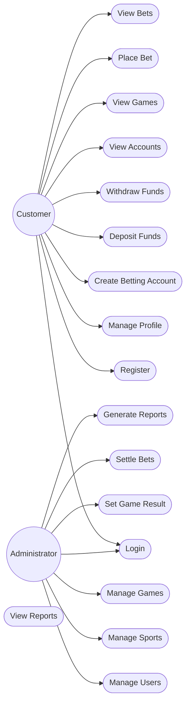
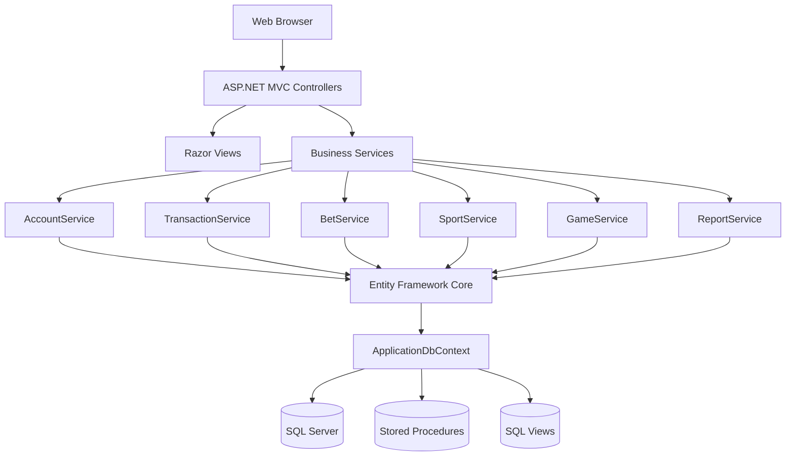
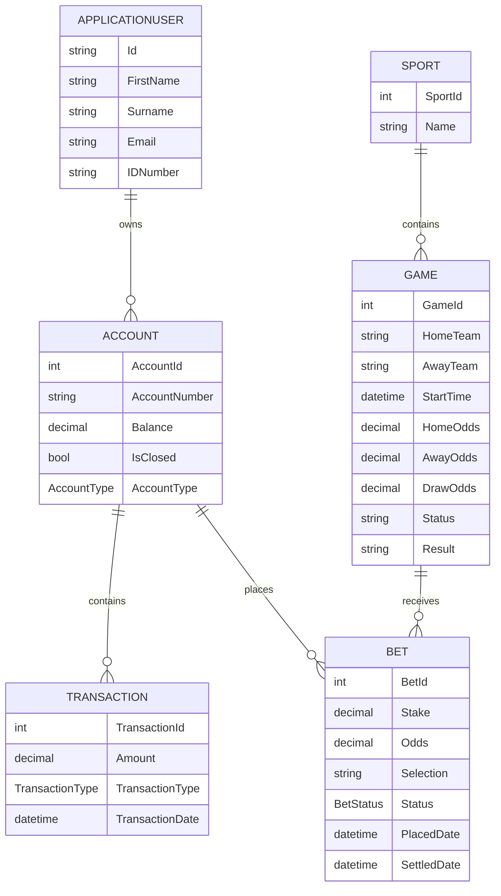
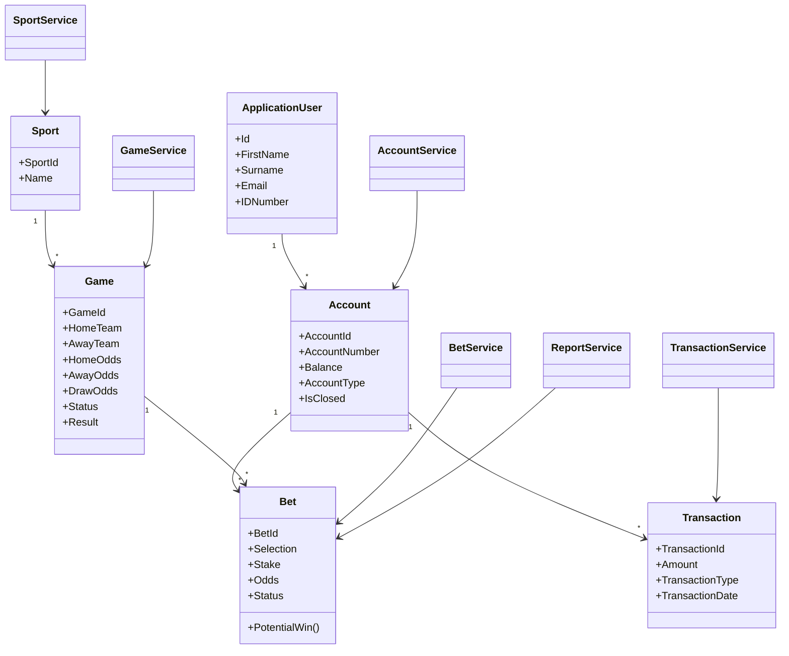
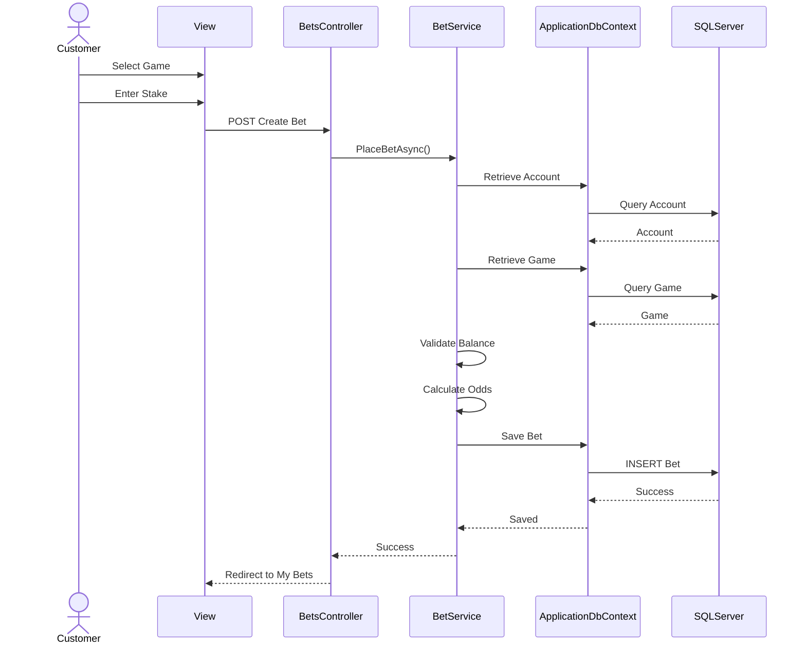
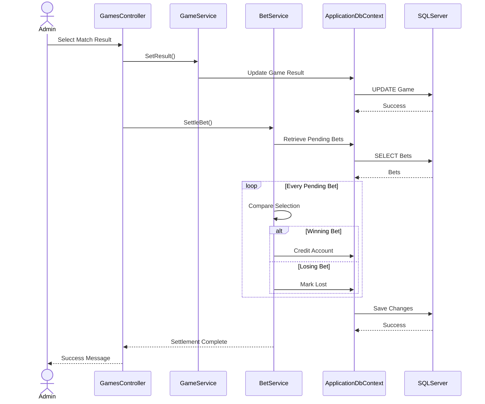

# SpinaBets Complete Project Documentation

## Table of Contents
1. Introduction
2. Objectives
3. Features
4. Technology Stack
5. Architecture
6. Database
7. Security
8. Admin Features
9. Customer Features
10. SQL Optimisation
11. Diagrams
12. Future Enhancements

## Introduction
SpinaBets is a full-stack ASP.NET Core MVC sports betting platform implementing role-based access control, betting accounts, transactions, betting, reporting and administration.

## Objectives
- Secure betting platform
- Account management
- Reporting
- Maintainable layered architecture

## Features
### Customer
- Registration/Login
- Betting accounts
- Deposits & Withdrawals
- Place Bets
- View History

### Administrator
- Dashboard
- Manage Users
- Manage Sports
- Manage Games
- Set Results
- Reports

## Technology Stack
- ASP.NET Core MVC
- Entity Framework Core
- SQL Server
- ASP.NET Identity
- Bootstrap 5

## SQL Optimisation
The application uses indexes, SQL Views and Stored Procedures for efficient reporting.

## Diagrams
### Use Case

### Architecture

### ERD

### Class

### Bet Sequence

### Settlement

## Future Enhancements
- Live betting
- Payment gateways
- Notifications
- Mobile application
